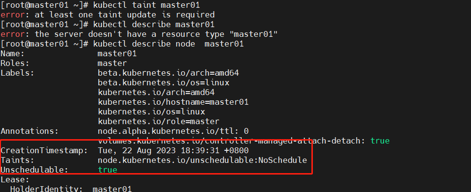
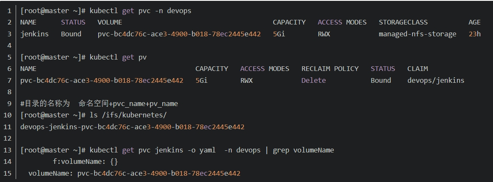

## 概念
### 污点（Taint）容忍度（Toleration）
1. 污点应用在节点之上， 容忍度应用在POD上。
2. 只有拥有和这个节点上污点相匹配容忍度的 Pod 才能够被分配到这个节点。(pod上的容忍度能够容忍node上的所有污点，才会将pod调度到node上)
3. 污点有三部分组成 key=value:effect
    >NoSchedule 新的不能容忍的pod不能再调度过来，但是之前运行在node节点中的Pod不受影响
    >NoExecute 新的不能容忍的pod不能调度过来，老的pod也会被驱逐
    >PreferNoScheduler 表示尽量不调度到污点节点中去
    ```bash
        kubectl describe master01
    ```

4. 添加,删除污点
   ```bash
    kubectl taint nodes node1 key1=value1:NoSchedule
    kubectl taint nodes node1 key1=value1:NoSchedule-
   ```
### pv pvc
1. pv  对应真实存在的存储，创建时需指定底层的实现，创建pv后集群就会由这么一个真实的资源。
2. pvc 声明了一种规格，不关注底层的实现是NFS、local还是ceph等，创建pvc后， 可在pod的yaml文件种指定使用，创建pod时才会与对应的pv进行绑定。
3. 持久化存储控制器（PersistentVolumeController），不断地查看当前每一个 PVC，是不是已经处于 Bound（已绑定）状态。如果不是，那它就会遍历所有的、可用的 PV，并尝试将其与这个“单身”的 PVC 进行绑定。
   


> 创建pv
```shell
    kubectl apply -f pv.yaml
```
> 为deploy创建svc
> kubectl get deployment
> kubectl expose deployment webapp --type=NodePort --name=nginx-service

> 创建的hostpath类型的pv，可以在宿主机上查看到创建的文件，不能在多个宿主机上共享。
