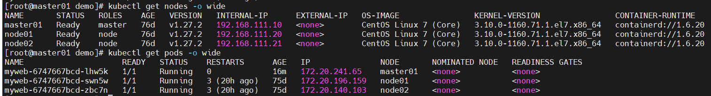

### 操作节点的
#### 查看k8s各组件版本
```bash
kubectl version --output=yaml
```

#### 设置master参与调度
```bash
# 之前版本可以通过这种方式删除node上的污点。
kubectl get nodes 
kubectl describe node k8s-master |grep Taints
kubectl taint node master01  node.kubernetes.io/unschedulable:NoSchedule-

# 通过kubeasz 安装的 1.27 版本 无法直接删除污点，通过以下命令可删除
kubectl uncordon master01  #允许参与调度
```



### kubeasz搭建后node节点没有权限
将master节点的 /root/.kube/congfig 文件复制到node节点相同目录。

### containerd 默认采用https拉取镜像
私有厂库一般为http的服务，需要将拉取默认方式改为http。
需要修改containerd的配置
```bash
vi /etc/containerd/config.toml
# 在对应位置添加
[plugins."io.containerd.grpc.v1.cri".registry.configs."192.168.111.10:5000".tls]
          insecure_skip_verify = true 
# 跟
[plugins."io.containerd.grpc.v1.cri".registry.mirrors."192.168.111.10:5000"]
          endpoint = ["http://192.168.111.10:5000"]
systemctl restart containerd
```

### 查看kubelet 等模块日志
```bash
# 查看服务名称
systemctl list-units | grep kube
journalctl -xefu kubelet
journalctl -xefu containerd
journalctl -xefu kube-proxy
```